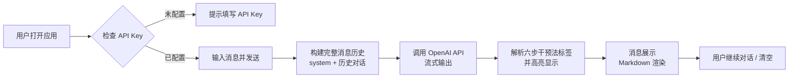
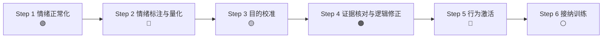

# 心伴 - 产品需求文档（PRD）

## 1. 产品概述

「心伴」是一款基于心理学六步干预法的认知疗愈对话助手，通过 AI 对话帮助用户代谢情绪、矫正认知偏差，从而重建面对现实的勇气。

- **产品定位**：温暖、专业、理性的情绪教练，而非虚拟恋人
- **目标用户**：有情绪疏导需求、希望获得认知层面支持的人群
- **核心价值**：基于科学心理学方法，提供结构化的情绪干预流程

## 2. 核心功能

### 2.1 功能模块

1. **对话主界面**：实时对话、消息展示、流式输出
2. **设置面板**：API Key 配置、模型选择、自定义 System Prompt
3. **六步干预法标签系统**：可视化展示当前干预阶段
4. **对话管理**：清空对话、历史记录内存保存
5. **暗色模式**：自动跟随系统偏好

### 2.2 页面详情

| 页面名称 | 模块名称 | 功能描述 |
|---------|---------|---------|
| 主页面 | 顶部导航栏 | 产品名「心伴」+ 副标题 + 设置按钮 |
| 主页面 | 对话区域 | 用户消息靠右（浅绿气泡）、AI 消息靠左（浅灰气泡）、Markdown 渲染 |
| 主页面 | 底部输入区 | 多行文本框 + 发送按钮 + 清空对话按钮 |
| 设置弹窗 | System Prompt | 可编辑的文本域，预填内置六步干预法 Prompt |
| 设置弹窗 | API 配置 | API Key 输入（密码类型）、模型选择下拉框 |
| 设置弹窗 | 保存按钮 | 保存设置到 localStorage |

## 3. 核心流程

### 用户对话流程

### 六步干预法流程

## 4. 用户界面设计

### 4.1 设计风格

- **主色调**：暖灰色系背景 + 淡蓝/淡绿点缀
- **整体感觉**：柔和、温暖、不刺眼、专业
- **气泡样式**：圆角 16px，用户气泡右上角尖角，AI 气泡左上角尖角
- **字体**：中文系统默认无衬线字体，15px，行高 1.8
- **标签样式**：六步干预法以彩色小气泡标签形式展示在 AI 消息开头

### 4.2 颜色系统

| 用途 | 颜色 | 色值参考 |
|-----|------|---------|
| 背景 | 暖白/暖灰 | #faf9f7 / #1a1a1a（暗色） |
| 用户气泡 | 淡绿色 | #dcfce7 / #166534（暗色） |
| AI 气泡 | 浅灰色 | #f3f4f6 / #27272a（暗色） |
| 主文字 | 深灰/浅灰 | #1f2937 / #f3f4f6 |
| 次要文字 | 中灰 | #6b7280 / #9ca3af |

### 4.3 页面设计概述

| 页面名称 | 模块名称 | UI 元素 |
|---------|---------|---------|
| 主页面 | 顶部导航 | 固定顶部、毛玻璃效果、产品名 + 副标题、设置按钮 |
| 主页面 | 对话区域 | 可滚动、消息气泡、六步标签、Markdown 渲染、打字动画 |
| 主页面 | 输入区域 | 固定底部、多行输入框、发送按钮、清空按钮、免责声明 |
| 设置弹窗 | 弹窗容器 | 居中、半透明遮罩、圆角、阴影 |
| 设置弹窗 | 表单 | 标签 + 输入框/下拉框/文本域、保存按钮 |

### 4.4 响应式设计

- 桌面端：最大宽度限制，居中布局
- 移动端：全屏宽度，输入框固定底部，适配触摸操作
- 断点：768px 为主要响应式断点

### 4.5 动效设计

- 打字动画：三点跳动（...）表示 AI 正在回复
- 消息入场：淡入 + 轻微上移动画
- 按钮悬停：背景色过渡
- 弹窗：淡入 + 缩放动画
