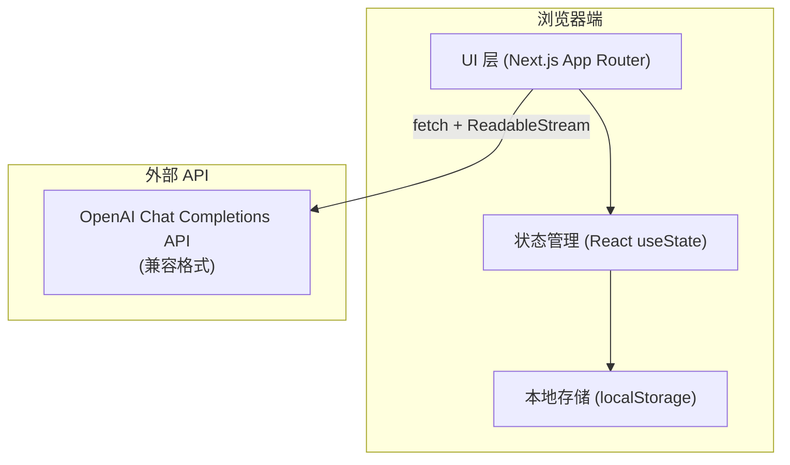

# 心伴 - 技术架构文档

## 1. 架构设计



## 2. 技术栈描述

- **前端框架**：Next.js 14+（App Router）
- **语言**：TypeScript 5+
- **样式**：Tailwind CSS 3+
- **Markdown 渲染**：react-markdown（轻量方案）
- **状态管理**：React useState（简单场景，无需额外状态库）
- **数据持久化**：localStorage
- **API 调用**：原生 fetch + ReadableStream 处理流式输出

## 3. 路由定义

| 路由 | 用途 |
|------|------|
| / | 主页面，包含对话界面 |

## 4. 项目结构

```
.
├── app/
│   ├── page.tsx              # 主页面
│   ├── globals.css           # 全局样式（Tailwind）
│   ├── layout.tsx            # 根布局
│   ├── components/
│   │   ├── ChatWindow.tsx    # 对话窗口组件
│   │   ├── MessageBubble.tsx # 消息气泡组件
│   │   ├── InputArea.tsx     # 输入区域组件
│   │   └── SettingsModal.tsx # 设置弹窗组件
│   └── lib/
│       ├── api.ts            # API 调用封装
│       └── prompt.ts         # 内置 System Prompt
├── public/                   # 静态资源
├── package.json
├── next.config.js
├── tailwind.config.ts
├── postcss.config.js
└── tsconfig.json
```

## 5. 核心数据模型

### 5.1 消息类型

```typescript
interface Message {
  id: string;
  role: 'user' | 'assistant' | 'system';
  content: string;
  stepTag?: StepTag;  // 六步干预法标签
}

type StepTag = 
  | 'normalization'   // 情绪正常化 🟢
  | 'labeling'        // 情绪标注 🔵
  | 'calibration'     // 目的校准 🟡
  | 'restructuring'   // 认知修正 🟠
  | 'activation'      // 行为激活 🔴
  | 'acceptance';     // 接纳训练 ⚪
```

### 5.2 设置类型

```typescript
interface Settings {
  apiKey: string;
  model: string;
  systemPrompt: string;
}
```

## 6. API 调用设计

### 6.1 OpenAI Chat Completions（流式）

**端点**：`https://api.openai.com/v1/chat/completions`（可配置兼容地址）

**请求体**：
```json
{
  "model": "gpt-4o",
  "messages": [
    {"role": "system", "content": "..."},
    {"role": "user", "content": "..."}
  ],
  "stream": true
}
```

**流式响应处理**：
- 使用 `ReadableStream` + `TextDecoder` 逐行解析 SSE 格式
- 提取 `delta.content` 并追加到消息
- 遇到 `[DONE]` 结束流

### 6.2 支持的模型

| 模型 ID | 显示名称 |
|---------|---------|
| gpt-4o | GPT-4o |
| gpt-4o-mini | GPT-4o Mini |
| claude-sonnet-4 | Claude Sonnet 4 |

## 7. 关键技术实现

### 7.1 流式输出处理

```typescript
// 使用 fetch + ReadableStream 实现 SSE 解析
// 逐字符更新 UI，实现打字机效果
```

### 7.2 六步干预法标签识别

- 从 AI 回复中解析特定标记（如 `[情绪正常化]`）
- 提取后以彩色标签形式渲染在消息开头
- 标签对应不同颜色和 emoji

### 7.3 localStorage 持久化

- API Key、模型选择、自定义 Prompt 保存在 localStorage
- 页面加载时从 localStorage 读取
- 对话历史仅保存在内存中（清空后重置）

### 7.4 暗色模式

- 使用 CSS `prefers-color-scheme` 媒体查询
- Tailwind `darkMode: 'media'` 配置
- 自动跟随系统主题切换
